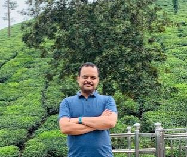

## Govindarajan Vishnuchithan

## About Me
### DevOps and Cloud Architect | Developer | Manager | Engineering Leader

A Versatile IT professional with 16 Years of industry experience, demonstrated leadership in many transformation programs donning the roles like Developer, Architect and Manager

## Education

> **_MBA (Systems)_**
> * Sikkim Manipal University (DDE), Rangpo, Sikkim, India
> * Helped me in solving business problems using information technology and the curriculum covered  Leadership skills

> **_BE (Electrical)_**
> * Madurai Kamaraj University, Madurai, India
> * Learnt Electrical and Electronics with good exposure to programming using C/C++

## Professional Experience

| Organization  | Position Held | Achievement |
| --- | --- |--- |
| `HP Inc R&D` | DevOps Architect | |

- 🔭 I’m currently working on DevSecOps
- 🌱 I’m currently learning Cloud Native Technologies
- 👯 I’m looking to collaborate on any open source project
- 🤔 I’m looking for help with setting up a sample app with all free saas based tools
- 💬 Ask me about DevOps and Cloud
- 📫 How to reach me: govindarajanv@gmail.com
- 😄 Pronouns: 'Go-Vind'

## Contact

- 📫 govindarajanv@gmail.com

    

